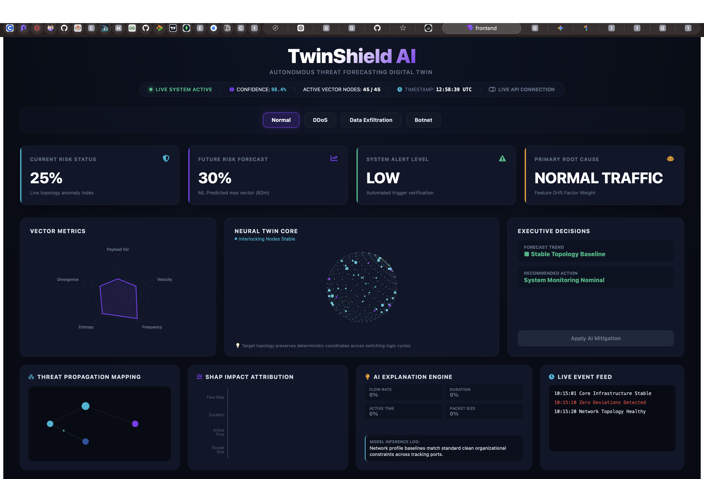
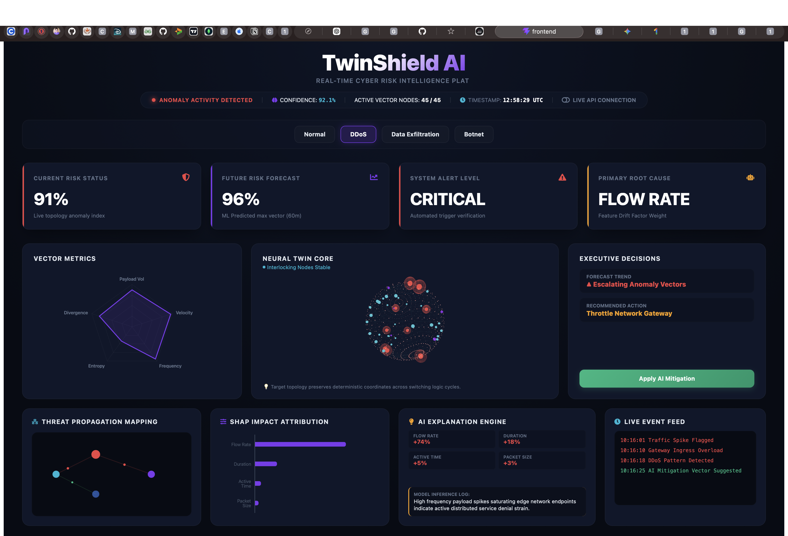
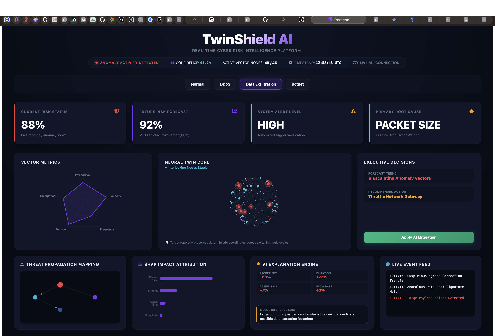
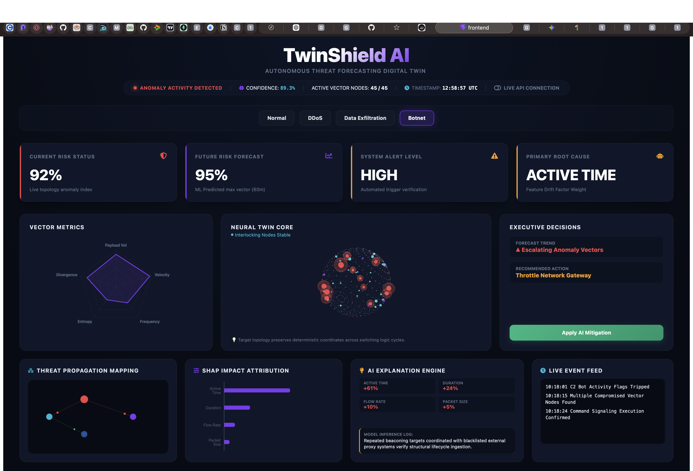
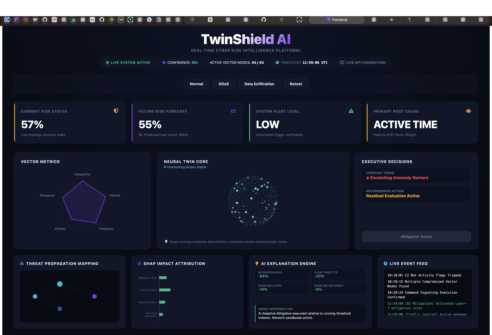

## Dashboard Preview

### Normal Traffic

### DDoS Attack

### Data Exfiltration

### Botnet Infection

### AI Mitigation

# TwinShield AI

Autonomous Threat Forecasting Digital Twin

## Overview

TwinShield AI is an intelligent cybersecurity platform that combines:

- Threat Forecasting
- Digital Twin Visualization
- Explainable AI (SHAP)
- Scenario Simulation
- AI-Driven Mitigation

to predict and explain cyber threats in real time.

---

## Features

### Threat Scenarios

- Normal Traffic
- DDoS Attack
- Data Exfiltration
- Botnet Infection

### AI Intelligence

- Risk Prediction
- Future Risk Forecasting
- Root Cause Analysis
- Feature Attribution
- Confidence Scoring

### Digital Twin

- Network Topology
- Threat Propagation Mapping
- Compromised Node Detection

### Explainability

- SHAP-style Feature Attribution
- AI Explanation Engine

---

## Tech Stack

Frontend:
- React
- Vite
- Framer Motion

Backend:
- FastAPI
- Python

Visualization:
- Recharts
- React Icons

---

## Architecture

User

↓

TwinShield Dashboard

↓

FastAPI API Layer

↓

Threat Intelligence Engine

↓

Risk Forecasting

↓

Explainability Layer

---

## Running

Backend:

cd backend
python3 -m uvicorn main:app --reload --port 8000

Frontend:

cd frontend
npm install
npm run dev

## Live Demo

Frontend:
https://twin-shield.vercel.app

Backend API:
https://twinshield-d4f3.onrender.com

API Documentation:
https://twinshield-d4f3.onrender.com/docs

Author
Chaithanya R  Hegde
